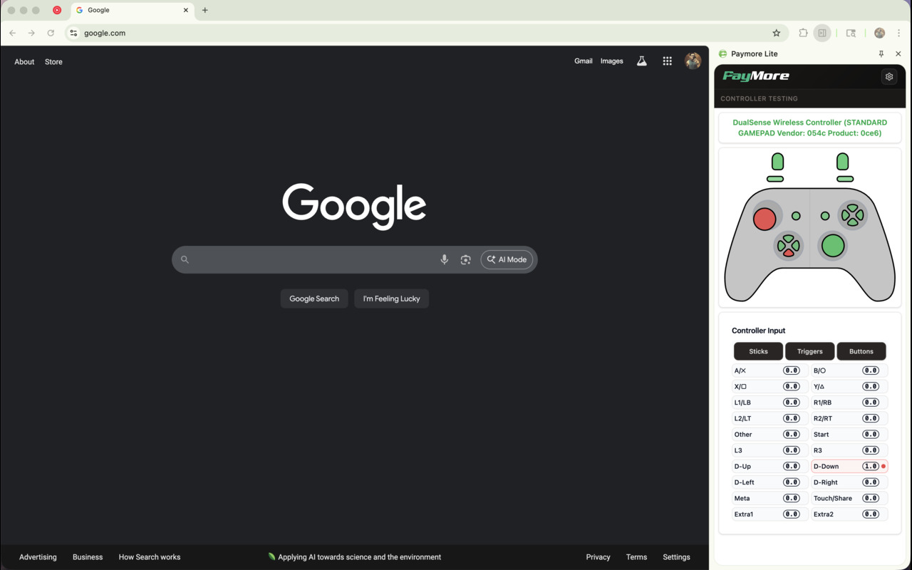
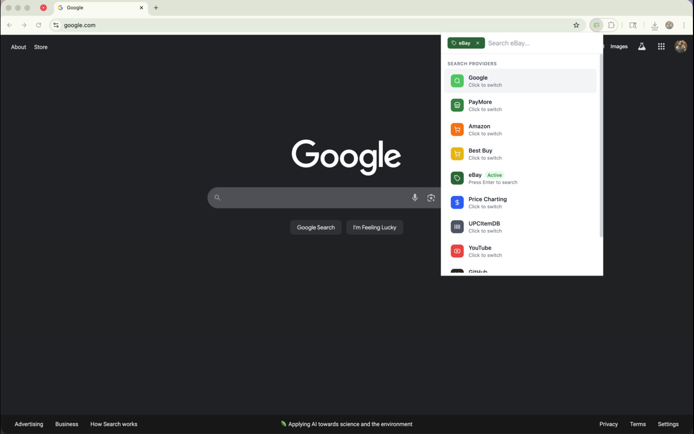

# Paymore Chrome Extension (Lite Version)

## Overview

Paymore Chrome Lite is a lightweight browser extension built with WXT (Web Extension Toolkit) and React. It provides essential tools for quick navigation and search specifically tailored for Paymore's operations. The lite version focuses on core functionality with a powerful CMDK command palette and settings interface.

**Current Version:** v1.0.0 (First Lite Release)

Key features:

- **CMDK Command Palette**: Arc-style command palette (CMD+Shift+K) for quick navigation, tab switching, and multi-provider search
- **Quick Links**: Cached custom links from Google Sheets with 30-minute caching
- **Tab Switching**: Fast switching between open tabs with search and filter
- **Search Providers**: 10 integrated search engines including PayMore, Google, Amazon, Best Buy, eBay, Price Charting, UPC Item DB, YouTube, GitHub, and Twitter/X
- **Bookmarks & History**: Access your 20 most recent bookmarks and last 30 visited pages
- **Settings Page**: Configure which command sources are enabled/disabled
- **Background Services**: Handle persistent tasks like API calls, storage, and notifications

The project uses Tailwind CSS v4 for styling, TypeScript for type safety, and PNPM for package management.

## Screenshots

Here are some screenshots showcasing the key features of the Paymore Chrome Lite extension:

### Command Menu


### Context Menu


### Controller Testing



### Search Providers



## Keyboard Shortcuts

The extension includes two keyboard shortcuts:

| Shortcut                       | Action          | Description                                                |
| ------------------------------ | --------------- | ---------------------------------------------------------- |
| `CMD+Shift+K` / `CTRL+Shift+K` | Open CMDK Popup | Launch the command palette for quick navigation and search |
| `CMD+Shift+O` / `CTRL+Shift+O` | Open Settings   | Access extension settings and configuration                |

You can customize these shortcuts at `chrome://extensions/shortcuts`.

## CMDK Command Palette

The CMDK (Command Palette) is the fastest way to navigate, search, and access extension features. Press `CMD+Shift+K` to open it.

**Features:**

- **Quick Links** - Custom links from Google Sheets, cached for instant loading
- **Tab Switching** - Jump to any open tab by typing its title or URL
- **Bookmarks** - Search your 20 most recent bookmarks
- **Recent History** - Browse your last 30 visited pages
- **Search Providers** - Type a trigger word (e.g., "ama" + Tab) to search on:
  - PayMore (`paymore`, `pm`, `pay`)
  - Google (`google`, `g`)
  - Amazon (`amazon`, `ama`, `amz`)
  - Best Buy (`bestbuy`, `bb`, `best`)
  - eBay (`ebay`, `eb`)
  - Price Charting (`pricecharting`, `pc`, `price`)
  - UPC Item DB (`upc`, `upcitemdb`, `barcode`)
  - YouTube (`youtube`, `yt`)
  - GitHub (`github`, `gh`)
  - Twitter/X (`twitter`, `x`)

For detailed CMDK documentation, see [CMDK_README.md](./CMDK_README.md).

## Prerequisites

- Node.js (v18 or higher)
- PNPM (v8 or higher) - Install via `npm install -g pnpm`
- Chrome browser (for testing)

## Installation

1. Clone the repository:

   ```
   git clone https://github.com/yourusername/paymore-lite.git
   cd paymore-lite
   ```

2. Install dependencies:

   ```
   pnpm install
   ```

3. Set up environment variables (if needed):
   - Copy `.env.example` to `.env.local` and fill in API keys (e.g., for Paymore backend, PriceCharting API).

## Development

1. Start the development server:

   ```
   pnpm dev
   ```

   This builds the extension and serves it for hot-reloading. The extension will be available in the `.output` directory.

2. Load the extension in Chrome:

   - Open Chrome and go to `chrome://extensions/`.
   - Enable "Developer mode".
   - Click "Load unpacked" and select the `.output` directory.

3. For hot-reloading during development:
   - Changes to source files will trigger rebuilds.
   - Reload the extension in Chrome to see updates.

### Scripts

- `pnpm dev`: Development mode with hot-reloading.
- `pnpm build`: Production build.
- `pnpm preview`: Preview the built extension.

## Project Structure

```
paymore-lite/
├── entrypoints/          # Extension entry points
│   ├── background.ts     # Background script & command handlers
│   ├── popup/            # CMDK Command Palette (default popup)
│   └── options/          # Settings page
├── public/               # Static assets (images, etc.)
├── src/                  # Source code
│   ├── components/       # React components
│   │   ├── cmdk-palette/ # CMDK components & search providers
│   │   ├── popups/       # Settings popup
│   │   └── ui/           # Reusable UI components
│   └── utils/            # Helper utilities (tab-manager, csv-links, bookmarks, history)
├── docs/                 # Documentation
├── releases/             # Release builds & changelog
├── CMDK_README.md        # CMDK feature documentation
├── tailwind.config.cjs   # Tailwind v4 configuration
├── wxt.config.ts         # WXT configuration (v1.0.0)
├── package.json          # Dependencies and scripts (v1.0.0)
└── tsconfig.json         # TypeScript configuration
```

## Key Configurations

- **WXT Config** ([wxt.config.ts](./wxt.config.ts)): Defines runtime, permissions, keyboard shortcuts, and entry points. Current version: **1.0.0**
- **Tailwind** ([tailwind.config.cjs](./tailwind.config.cjs)): Tailwind v4 with Vite plugin for class scanning and HMR
- **TypeScript**: Strict mode enabled for better code quality
- **Permissions**: storage, tabs, activeTab, bookmarks, history

## Building for Production

1. Build the extension:

   ```
   pnpm build
   ```

2. The output will be in `.output/`, ready for zipping and submission to Chrome Web Store.

3. To zip for store submission:
   ```
   pnpm zip
   ```
   This will create a zip file in the `.output` directory ready for Chrome Web Store submission.

## Testing

- **Manual Testing**: Load in Chrome and test CMDK popup and settings page
- **Unit Tests**: Add Jest or Vitest for component testing (not implemented yet)

## Deployment to Chrome Web Store

1. Create a developer account at [Chrome Web Store](https://chrome.google.com/webstore/devconsole).
2. Prepare assets: icons, screenshots (in `public/assets/`).
3. Upload the zip file generated from build.
4. Fill in store listing details (description provided separately).

## Releases

Stable releases are available in the [releases/](./releases/) folder. Download the latest version (v1.0.8) from the releases section.

See [releases/releases.md](./releases/releases.md) for detailed changelog and installation instructions.

### Quick Installation

1. Download [paymore-chrome-lite-1.0.0-chrome.zip](./releases/paymore-chrome-lite-1.0.0-chrome.zip)
2. Unzip the file
3. Open Chrome and navigate to `chrome://extensions/`
4. Enable "Developer mode" (toggle in top right)
5. Click "Load unpacked"
6. Select the unzipped `paymore-chrome-lite` folder

## Troubleshooting

### General Issues

- **Hot-reload not working**: Restart `pnpm dev` and reload extension
- **Content script issues**: Check console in page inspect (ensure permissions in manifest)
- **Build errors**: Verify Node/PNPM versions; clear cache with `pnpm store prune`
- **Tailwind styles missing**: Ensure PostCSS is configured correctly

### CMDK Issues

- **CMDK doesn't open**: Check `chrome://extensions/shortcuts` for keyboard shortcut conflicts
- **Quick Links not loading**: Check DevTools Console for CSV fetch errors; clear cache via `chrome.storage.local.clear()`
- **Bookmarks/History not showing**: Reload extension to re-request permissions
- **Arrow keys don't work**: Click inside the search input to focus it

For detailed CMDK troubleshooting, see [docs/CMDK_README.md](./docs/CMDK_README.md#troubleshooting).

## Contributing

1. Fork the repo.
2. Create a feature branch: `git checkout -b feature/amazing-feature`.
3. Commit changes: `git commit -m 'Add amazing feature'`.
4. Push: `git push origin feature/amazing-feature`.
5. Open a Pull Request.

## License

MIT License - see LICENSE file for details.

For issues or questions, open a GitHub issue.
